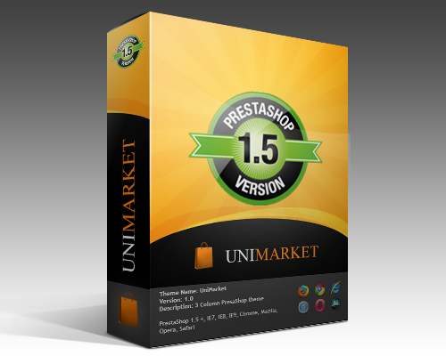
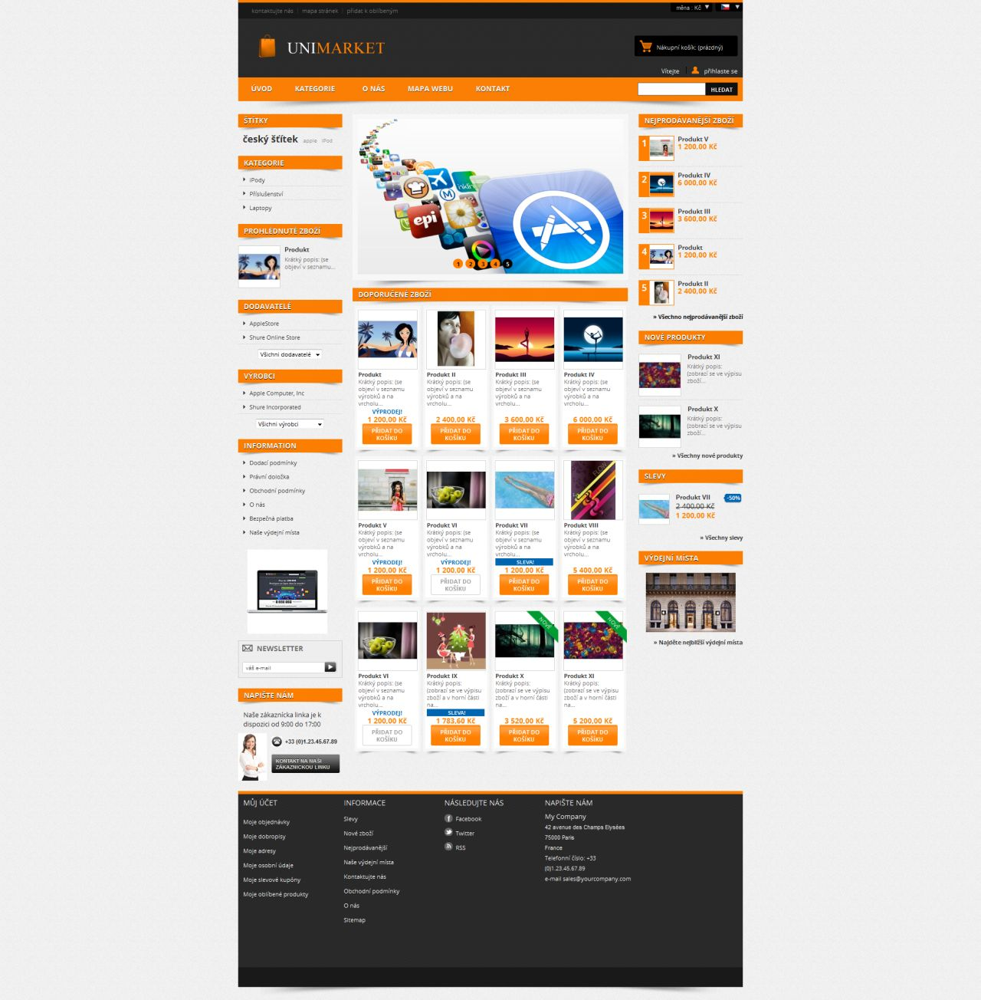

# UniMarket – PrestaShop Theme

UniMarket is a modern and customizable PrestaShop theme, designed to provide a seamless shopping experience. This theme is available in **5 vibrant color variants** to suit your store's branding:

1. UniMarket - Orange 🍊
2. UniMarket - Violet 🌸
3. UniMarket - Yellow 🌟
4. UniMarket - Bleen 🌊
5. UniMarket - Green 🌿

---
## Preview
Here’s a preview of the UniMarket theme in action:

## How to Access?

UniMarket themes are exclusively available to our **GitHub Sponsors**. Support our project and gain access to all theme variants.

### Steps to Get Access:
1. Become a [GitHub Sponsor](https://github.com/sponsors/phirebase). 🤖 Access to Code! Unlock access to private repositories and dive into exclusive projects and resources. $20 a month / Sponsors will be automatically invited to private repositories with all color variants.  
2. Download the theme of your choice and start building your store!

---

## Features
- **Modern Design**: Clean and responsive layout.
- **SEO Optimized**: Enhance search engine visibility.
- **Customizable**: Built on the Smarty framework for easy customization.
- **Lightweight and Fast**: Optimized for performance.

---

<!--## Screenshots
  
_Example of UniMarket in action. Screenshot or GIF here._--!>

---

For more information or support, feel free to reach out through GitHub issues or contact us directly as a sponsor. Thank you for supporting UniMarket!
